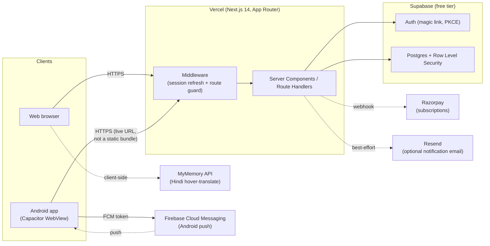

# Architecture & Production Reference

Technical reference for how Transfer Setu is built, deployed, and operated. For setup/local-dev instructions see [README.md](README.md); this document covers *how the system fits together and runs in production*.

## 1. System overview



**Core idea:** one Next.js codebase, deployed once to Vercel, serves both the website and — via a thin Capacitor shell — the Android app. The native app is not a separate build of the frontend; it's a WebView pointed at the live production URL. This has a load-bearing consequence covered in §5.

## 2. Tech stack

| Layer | Choice | Why |
|---|---|---|
| Framework | Next.js 14 (App Router, RSC) | SSR + server actions + API routes in one deploy target |
| Hosting | Vercel (Hobby) | Zero-config Next.js deploys, serverless functions, free tier |
| Database / Auth | Supabase (free tier) | Postgres + RLS + magic-link auth, no separate backend to run |
| Styling | Tailwind CSS | Utility classes double as the design-token system (see §7) |
| Native shell | Capacitor 6 (Android; iOS scaffold present, untested) | Wraps the live site in a WebView rather than a static export |
| PDF generation | pdf-lib | Server-side joint-application PDF, no external service |
| Payments | Razorpay (REST API, no SDK) | UPI/India-first, free until a subscription is actually taken |
| Push notifications | Firebase Cloud Messaging (Android only) | Required by `@capacitor/push-notifications` on Android |
| Tests | Vitest | Unit tests for the matching engine only (`tests/matching.test.ts`) |

No paid infrastructure is required to run this in production at small scale.

## 3. Application structure

```
src/
├── app/
│   ├── (public)/        # landing, sign-in, how-it-works, privacy — no auth required
│   ├── (app)/            # dashboard, browse, matches, preferences, profile,
│   │                      settings, billing, admin/* — gated by middleware
│   ├── api/               # route handlers (REST-ish JSON endpoints)
│   ├── auth/callback/     # PKCE code exchange → session cookie
│   ├── layout.tsx         # root layout: fonts, PWA/native bridges, error checker
│   ├── error.tsx / global-error.tsx   # error boundaries (see §8)
│   └── icon.svg           # app icon / logo source
├── components/            # shared UI (forms, cards, badges, icons.tsx, illustrations.tsx)
├── lib/
│   ├── matching/          # engine.ts, rules.ts, recompute.ts — the matching algorithm
│   ├── supabase/          # server.ts (SSR + admin clients), client.ts (browser client)
│   ├── auth.ts            # getUser/getProfile/requireUser/requireAdmin
│   ├── billing.ts, razorpay.ts
│   ├── native.ts           # Capacitor bridge helpers (see §5)
│   └── types.ts
android/                    # Capacitor-generated native project (git-tracked)
supabase/migrations/        # hand-written SQL migrations (0001–0003)
```

Route groups `(public)` and `(app)` share the root layout but have separate nested layouts: `(app)/layout.tsx` calls `requireUser()` and renders `TopNav` with `signedIn`; `(public)/layout.tsx` renders the same `TopNav` unauthenticated. Both are additionally enforced by `middleware.ts`.

## 4. Request & auth flow

1. **`middleware.ts`** runs on every request (excluding static assets). It refreshes the Supabase session cookie via `@supabase/ssr` and redirects unauthenticated requests to `/sign-in` for any path under `PROTECTED` (`/dashboard`, `/browse`, `/matches`, `/preferences`, `/profile`, `/notifications`, `/settings`, `/onboarding`, `/admin`, `/billing`).
2. **Sign-in** is passwordless: `supabase.auth.signInWithOtp()` sends a PKCE magic link. `authRedirectUrl()` ([native.ts](src/lib/native.ts)) chooses the redirect target: the hosted `/auth/callback` on web, or the custom scheme `mutualtransfer://auth/callback` inside the native app.
3. **`/auth/callback/route.ts`** exchanges the PKCE `code` for a session (`exchangeCodeForSession`), then routes first-time users to `/onboarding` or returning users to their intended `next` path.
4. **Native deep link:** `NativeBridge` ([native-bridge.tsx](src/components/native-bridge.tsx)) listens for `appUrlOpen`, extracts `code`/`next` from the custom-scheme URL, and does `window.location.replace('/auth/callback?...')` — i.e. the deep link is just forwarded into the same web callback route, so auth logic is never duplicated between web and native.
5. Session state lives in cookies (`sb-<project-ref>-auth-token`, chunked/base64url-encoded by `@supabase/ssr`), read server-side in every Server Component via `createClient()` and enforced at the database via RLS — not just hidden in the UI.

## 5. Native app architecture (important operational detail)

`capacitor.config.ts` sets `server.url` to the deployed Vercel URL. This means:

- **The installed APK is a near-permanent shell.** Almost all product changes (UI, copy, business logic, new pages) ship the instant they're pushed to `main` and deployed — no APK rebuild, no reinstall, no app-store review.
- **A new APK build is only needed** when something *native* changes: Capacitor plugins, Android permissions, the app icon/splash screen, `capacitor.config.ts` itself, or the `CAP_SERVER_URL` the shell points at.
- Because of this, an **in-app update banner** ([update-checker.tsx](src/components/update-checker.tsx)) polls `/api/version` (which echoes `VERCEL_GIT_COMMIT_SHA`) and prompts a reload if a newer deployment is detected while the app is already open — covering the case where Android keeps the WebView alive across a background/foreground cycle instead of doing a fresh navigation.
- **Push notifications require Firebase** (`google-services.json` + `FirebaseApp.initializeApp()` in `MainActivity`, already wired up). Without it, `PushNotifications.register()` throws on Capacitor's native plugin thread — outside any JS `try/catch` — and crashes the whole app. This is a real incident this project hit; see the git history around the Firebase fix for the failure mode if it recurs.
- Release builds: `CAP_SERVER_URL="https://<prod-domain>" npx cap sync android && cd android && ./gradlew assembleDebug` (or `bundleRelease` for a signed Play Store build, not yet configured).

## 6. Matching engine

Domain model: each profile has a current posting and an ordered list of preferred postings. A **directed edge** `A → B` exists when A wants B's current location *and* the two satisfy the configurable hard rules (cadre, designation, pay level — [rules.ts](src/lib/matching/rules.ts)).

- **Direct match** = a 2-cycle (`A → B → A`): both parties want each other's seat.
- **Chain match** = an n-cycle (`A → B → C → A`): everyone moves into the next person's seat.

[engine.ts](src/lib/matching/engine.ts) builds the edge set and detects cycles up to a configurable length; [recompute.ts](src/lib/matching/recompute.ts) persists results into the `matches` + `match_consents` tables, keyed by a stable signature (`directSignature`/`chainSignature`) so recomputes don't duplicate rows. Recompute is triggered manually (`RecomputeButton` → `/api/matches/recompute`) rather than on every write, to keep it cheap on the free tier.

Consent gating: contact details are only exposed once *every* member of a match has consented (`match_consents`), enforced by RLS policies on the `profiles`/`matches` join — not by client-side conditionals.

## 7. Database schema (Supabase Postgres)

| Table | Purpose |
|---|---|
| `profiles` | One row per user; cadre, designation, pay level, current posting, contact info, verification status, `is_admin` |
| `locations` | Bundled state/district reference data |
| `preferences` | A profile's ordered wish-list of target districts |
| `rules_config` | Admin-tunable hard-rule configuration (per department/state) |
| `matches` | Detected direct/chain matches, deduped by signature, with a `status` lifecycle |
| `match_consents` | Per-member opt-in before contact is revealed |
| `messages` | In-app chat, unlocked post-consent |
| `notifications` | In-app notification feed |
| `reports` | User-submitted abuse/moderation reports |
| `device_tokens` | FCM tokens for push (0002) |
| `subscriptions` | Razorpay subscription state (0003) |

All access is governed by **Row Level Security**; the service-role key (`createAdminClient()`) is used only for trusted server code — match recompute, admin actions, hard account deletion — and is never sent to the browser.

## 8. Observability & error handling

- **`error.tsx`** / **`global-error.tsx`**: every client-side render error is caught, shown as a friendly retry/reload screen (not Next.js's bare generic message), and POSTed to **`/api/client-error`**, which logs the full stack trace to stdout — visible in **Vercel → Runtime Logs**.
- Server-side exceptions (e.g. a misconfigured env var) surface the same way: Vercel's Runtime Logs are the first place to look, searchable by digest.
- No third-party error tracking (Sentry etc.) is wired up — intentional, to stay on the free tier. `Vercel Runtime Logs` + the `/api/client-error` sink are the whole observability story today.

## 9. Design system

Introduced in the July 2026 redesign — warm terracotta accent (`brand-*`) and warm-neutral scale (`sand-*`, replacing Tailwind's default slate) defined in [tailwind.config.ts](tailwind.config.ts), applied globally via [globals.css](src/app/globals.css) component classes (`.btn`, `.card`, `.input`, `.badge`). Typography pairs a serif display face (Fraunces, via `next/font`) with Inter for body text. All iconography is a hand-authored SVG set in [icons.tsx](src/components/icons.tsx) — no icon-font dependency. Because the primitives are shared, most pages inherit the visual system automatically without page-specific styling work.

## 10. Deployment & environments

- **Source of truth:** GitHub (`nileshraj757/Mutual_transfer`, `main` branch). Every push to `main` triggers a Vercel production deployment automatically.
- **Environment variables** (Vercel → Settings → Environment Variables — see `.env.example` for the full list): Supabase URL/anon/service-role keys, `NEXT_PUBLIC_SITE_URL`, `OFFICIAL_EMAIL_DOMAINS`, Razorpay keys (optional — billing no-ops until set), Resend key (optional). `NEXT_PUBLIC_*` values are baked in at build time, so adding/changing one requires a fresh deployment, not just a dashboard save.
- **Known gotcha:** Vercel blocks the dashboard "Redeploy" action when the triggering commit's author email isn't a verified email on an account with project access ("Hobby teams do not support collaboration"). Workaround: push a new commit (even an empty one) instead of using the Redeploy button — a git-triggered deploy isn't subject to that check.
- **Supabase project** is shared between local dev and production (same database) — there is no separate staging environment. Migrations are applied by hand (`supabase/migrations/*.sql`, no migration runner configured).
- **Native release** is manual and out-of-band from the web deploy (see §5): build the APK locally, distribute the file directly (no Play Store listing yet).

## 11. Security & privacy model

- RLS is the actual enforcement boundary for "contact details are private until consent" and "you only see your own preferences/matches" — the UI hides things too, but the database would refuse the query either way.
- Employee IDs are stored hashed/masked ([hash.ts](src/lib/hash.ts)); full IDs are never displayed, only used for verification matching.
- `OFFICIAL_EMAIL_DOMAINS` restricts sign-up to specified email domains when set.
- Rate limiting ([rate-limit.ts](src/lib/rate-limit.ts)) is an in-memory sliding window — a best-effort deterrent, not a strict global limit (serverless instances don't share memory). Acceptable at current scale; would need a shared store (e.g. Upstash Redis) to harden.
- Account deletion (`/api/account/delete`) is a hard delete via the admin client, fulfilling DPDP 2023 right-to-erasure.

## 12. Known limitations (by design, for cost/scope reasons)

- No CI pipeline — `npm run typecheck` / `npm run build` / `npm test` are run manually before pushing.
- No staging environment — production Supabase project doubles as the dev database.
- No automated E2E tests — verification for this project has been manual (Playwright driven ad hoc, Chrome DevTools Protocol against the live Android WebView) rather than a committed test suite.
- Push notifications are Android-only; iOS Capacitor scaffold exists but is untested.
- Play Store release signing is not configured — current APKs are debug builds, sideloaded.
